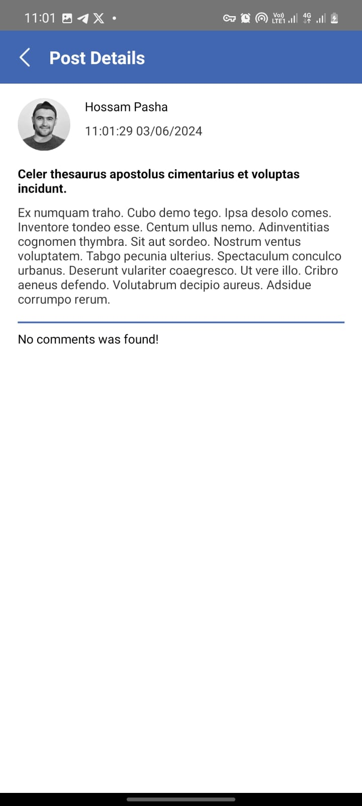

# Posts App

This project is a simple social mobile application that contains 3 screens for list posts and show comments with animated splash screen. It is built using React Native, which allows you to create natively-rendered mobile applications for iOS and Android using a single codebase.

## Screenshots

| --- | --- | --- | --- | --- | --- |
|  |  |  |  |

## Installation

Clone the repository and navigate into the project directory:

```bash
git clone https://github.com/HossamBhi/posts-social-media-app.git
cd posts-social-media-app
```

Install the project dependencies:

```bash
yarn install
```

## Running the Project

### iOS

1- Navigate to the ios directory and install the CocoaPods dependencies:

```bash
cd ios
pod install
cd ..
```

2- Run the project on an iOS simulator:

```bash
npx react-native run-ios
```

This command will build the app and launch it on the iOS simulator.

### Android

1- Make sure the Android emulator is running or an Android device is connected.
2- Run the project on an Android device or emulator:

```bash
npx react-native run-android
```

This command will build the app and launch it on the connected Android device or emulator.

## Troubleshooting

### Common Issues

- Metro Bundler not starting: Ensure you don’t have any conflicting processes running on port 8081. You can kill any process using port 8081 with:

```
npx kill-port 8081
```

- Build failed with error: Ensure all the dependencies are correctly installed and you have the latest versions of npm, react-native, and the relevant SDKs.

- Xcode build errors: Ensure that your Xcode Command Line Tools are up to date. You can update them from Xcode > Preferences > Locations.

### Useful Commands

- Start the Metro Bundler manually:

```
npx react-native start
```

- Clean the project:

```
cd android && ./gradlew clean && cd ..
cd ios && xcodebuild clean && cd ..
```

## Contributing

If you would like to contribute to this project, please fork the repository and submit a pull request. Ensure your code adheres to the project's coding standards and is well documented.

Please make sure to update tests as appropriate.

## License

[MIT](https://choosealicense.com/licenses/mit/)
